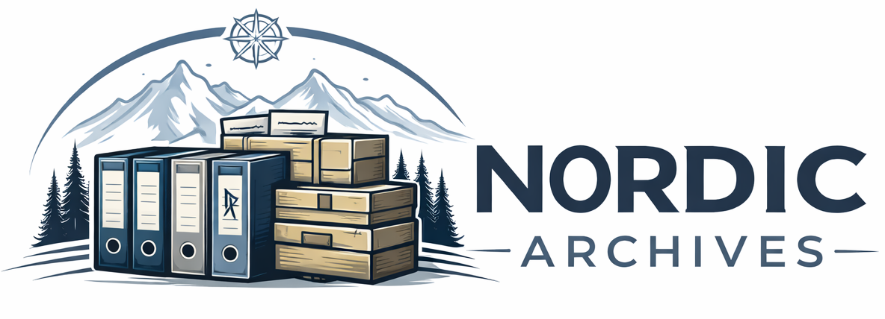

# 

# Nordic Archives CTF

First appeared for IT-säkerhetstestare 2025 @ course "Hacking och sårbarhetsanalys"

A CTF web challenge built around a fictional document archiving portal.
Designed for beginner to intermediate web security training and can be run
locally with minimal setup. Focus is on OSINT/recon and web

Objectives: Find 2 flags - vault flag and admin flag

Do not look at the code before trying the challenge, will spoil the flags

## Quick start (Docker Compose)

Clone repo

```bash
git clone https://github.com/ettelman/nordic_archives.git
cd nordic_archives
docker compose up --build
```

Open `http://localhost:3000` in your browser.

To use a different host port:

```bash
HOST_PORT=4000 docker compose up --build
```

## Intended use

This project is for educational and training purposes only. Run it in a local,
controlled environment. The application is intentionally insecure by design.
Do not deploy, or do so at your own risk.

## Local development

```bash
npm install
npm start
```

Also requires chromium to be installed in any of the usual linux paths for bins

## Environment

Copy `.env.example` to `.env` if you want to override defaults such as admin
credentials, session secret or flags

## License

This project is open source under the MIT License. You are free to use, modify,
and redistribute it as long as the copyright and attribution notice for
`ettelman` is kept intact. See [LICENSE](LICENSE).
